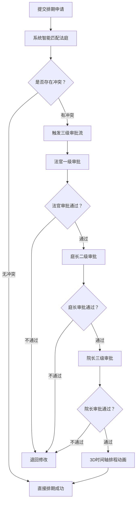
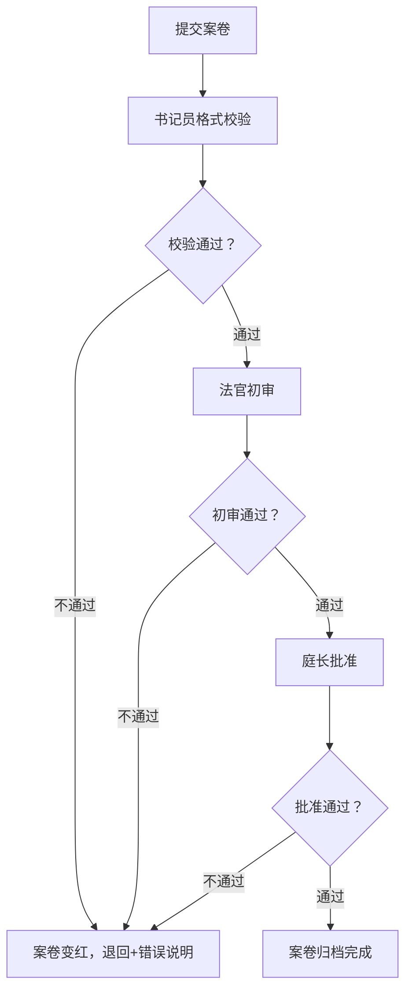
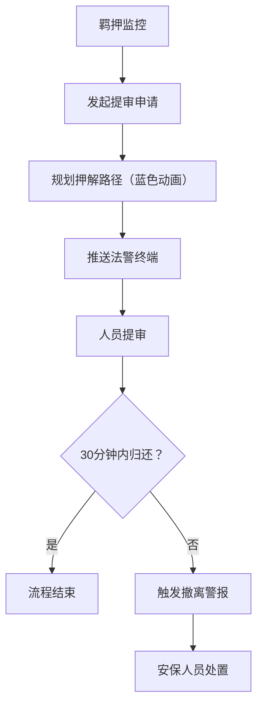

## 1. 产品概述

面向城市司法机关的3D交互可视化法庭庭审调度与安全保障平台，通过三维建模技术实现法院全场景数字化管理，覆盖审判法庭、调解室、律师阅卷区、羁押室和安保指挥中心五大核心区域。平台整合庭审调度、案卷流转、人员监管、安全保障四大业务模块，实现司法资源智能分配、流程可视化追踪、风险实时预警，全面提升法院运作效率与安全保障水平。

- 目标用户：法院书记员、法官、庭长、院长及安保人员
- 核心价值：3D可视化管理、智能资源调度、全流程安全管控、数据驱动决策

## 2. 核心功能

### 2.1 用户角色

| 角色 | 登录方式 | 核心权限 |
|------|----------|----------|
| 书记员 | 人脸识别 | 案件登记、案卷格式校验、笔录录入、统计导出 |
| 法官 | 人脸识别 | 庭审管理、案卷初审、笔录校验、查看排期 |
| 庭长 | 人脸识别 | 法庭资源分配、审批冲突案件、案卷批准、部门监管 |
| 院长 | 人脸识别 | 全院调度、三级终审审批、全局统计、系统管理 |

### 2.2 功能模块

1. **3D可视化总览**：法院建筑3D模型、各区域实时状态、全局数据仪表盘
2. **庭审调度系统**：法庭状态监控、智能排期分配、冲突审批流程、3D时间轴展示
3. **案卷流转系统**：电子卷宗提交、多级校验审批、退回追踪、流转记录
4. **羁押安全系统**：在押人员监控、押解路径规划、超时警报、法警终端推送
5. **笔录管理系统**：实时笔录生成、关键信息校验、自动催办补录
6. **权限与日志**：四级权限管理、人脸识别登录、操作日志审计
7. **统计导出系统**：多维度数据统计、Excel报表导出、超期提醒清单

### 2.3 页面详情

| 页面名称 | 模块名称 | 功能描述 |
|----------|----------|----------|
| 登录页 | 人脸识别面板 | 人脸扫描动画、角色选择、登录状态反馈 |
| 3D总览页 | 法院3D场景 | 建筑3D模型渲染、区域切换、状态热力图、悬浮提示 |
| | 数据仪表盘 | 在审案件数、法庭使用率、在押人员、待审批事项 |
| 庭审调度页 | 法庭3D视图 | 各法庭模型状态显示、案号/当事人/合议庭信息、进度状态 |
| | 智能排期 | 案件类型匹配、设备分配算法、冲突检测、推荐方案 |
| | 审批流程 | 三级审批卡片、审批意见、状态流转、历史记录 |
| | 3D时间轴 | 排程动画、时间节点、拖拽调整、资源冲突标注 |
| 案卷管理页 | 案卷流转 | 案卷3D模型、状态颜色标识、流转节点、审批链展示 |
| | 校验面板 | 格式校验规则、错误高亮、退回原因、补录指引 |
| 羁押监控页 | 羁押室3D视图 | 单间占用状态、人员数量统计、详情面板 |
| | 押解路径 | 蓝色路径动画、时间估算、法警终端推送状态 |
| | 警报系统 | 超时警报、声光提示、处置按钮、记录归档 |
| 笔录管理页 | 笔录编辑器 | 实时同步输入、关键信息标记、完整性校验 |
| | 催办系统 | 缺失项清单、自动提醒、补录状态追踪 |
| 统计导出页 | 统计仪表盘 | 开庭次数统计、平均时长分析、超期案件清单 |
| | 导出中心 | 按案号/日期筛选、Excel生成下载、证据材料清单 |

## 3. 核心流程

### 3.1 庭审调度流程
用户登录系统后，提交新案件排期申请。系统根据案件类型（刑事/民事/行政）、审判人员资质、设备需求自动匹配最优法庭。如检测到高优先级案件冲突，触发法官→庭长→院长三级审批流程。审批通过后，3D时间轴动态展示排程动画，完成最终排期。

### 3.2 案卷流转流程
案卷提交后，先由书记员进行格式校验。校验不通过则案卷模型变红并退回，附错误说明。通过后进入法官初审，再由庭长批准，三级流转完成后方可进入正式归档。

### 3.3 羁押与押解流程
系统实时监控羁押室人员数量与单间状态。提审申请发起后，自动规划蓝色押解路径动画，并推送信息至法警终端。超过30分钟未归还则触发撤离警报，通知安保人员处置。

## 4. 用户界面设计

### 4.1 设计风格

- **主色调**：深邃藏蓝 `#0A1628`（司法专业感）搭配 法庭金 `#C9A86C`（权威庄重）
- **辅助色**：状态绿 `#10B981`、警告橙 `#F59E0B`、警报红 `#EF4444`、信息蓝 `#3B82F6`
- **按钮风格**：微立体圆角矩形，hover时微妙光影变化，disabled时灰化处理
- **字体**：标题使用「思源宋体」（司法文书传统感），正文使用「思源黑体」（现代可读性）
- **布局风格**：主3D画布居中 + 左侧导航面板 + 右侧数据抽屉 + 顶部状态栏
- **图标风格**：线性简洁图标（lucide-react），关键状态使用微发光效果
- **氛围**：深色科技感 + 司法庄重感，3D场景配柔和环境光，关键元素描边发光

### 4.2 页面设计概述

| 页面名称 | 模块名称 | UI元素 |
|----------|----------|----------|
| 登录页 | 人脸识别面板 | 圆形扫描框、扫描线动画、人脸网格、角色切换卡片、玻璃拟态登录框 |
| 3D总览页 | 法院3D场景 | 可旋转缩放建筑模型、区域高亮、悬浮信息卡、状态指示灯、摄像机路径动画 |
| | 数据仪表盘 | 玻璃拟态数据卡、数字滚动动画、迷你趋势图、环形进度图 |
| 庭审调度页 | 法庭3D视图 | 法庭内景模型、全息信息面板、进度灯条（未开庭/审理中/休庭/闭庭）、点击放大动画 |
| | 3D时间轴 | 立体时间轴、案件卡片悬浮、冲突连线、排程粒子动画 |
| 案卷管理页 | 案卷3D视图 | 文件夹模型堆叠、颜色状态编码、流转连接线、审批节点光点 |
| 羁押监控页 | 押解路径 | 蓝色发光路径、人员圆点移动动画、进度百分比、警报闪光 |

### 4.3 响应式设计

- 桌面端优先（1920×1080标准分辨率），面向法院大屏展示
- 支持2560×1440及以上2K/4K分辨率自适应缩放
- 侧边面板可折叠以提供更大3D画布空间
- 关键弹窗支持拖拽移动
- 触控屏手势支持（双指缩放、单指旋转3D场景）

### 4.4 3D场景指引

- **环境**：深蓝夜空 + 微弱星云粒子背景，HDR模拟室内柔和天光
- **光照**：主光冷白色模拟法庭照明 + 暖色补光模拟旁听席 + 轮廓光勾勒建筑边缘
- **摄像机**：默认45°俯视全局视角，支持轨道控制器旋转缩放，点击区域自动平滑过渡飞行
- **焦点元素**：法庭法官席、羁押室入口、指挥中心大屏使用发光材质突出
- **交互**：鼠标悬浮区域轻微上浮+发光描边，点击时相机平滑飞行至目标位置并展开详情面板
- **后处理**：轻微Bloom发光、FXAA抗锯齿、SSAO环境光遮蔽增强立体感
- **性能**：3D模型使用低面数几何体配合程序化纹理，单场景三角面控制在10万以内
