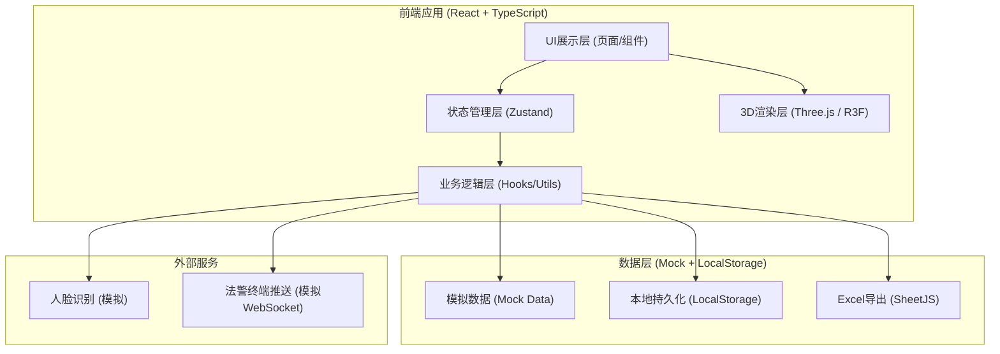
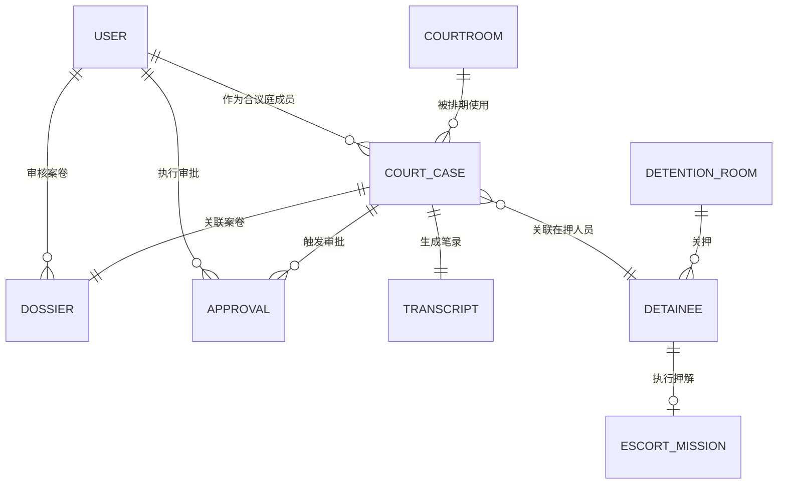

## 1. 架构设计



## 2. 技术说明

- **前端框架**: React@18 + TypeScript + Vite
- **UI样式**: TailwindCSS@3 + 自定义CSS变量主题
- **3D渲染**: three@0.160 + @react-three/fiber@8 + @react-three/drei@9 + @react-three/postprocessing@2
- **状态管理**: zustand@4
- **路由管理**: react-router-dom@6
- **图标库**: lucide-react
- **Excel导出**: xlsx (SheetJS)
- **初始化工具**: vite-init (react-ts模板)
- **后端**: 纯前端模拟 (Mock数据 + LocalStorage持久化)
- **数据存储**: LocalStorage + 内存状态管理

## 3. 路由定义

| 路由 | 页面名称 | 功能说明 |
|------|----------|----------|
| `/login` | 登录页 | 人脸识别登录 + 角色选择 |
| `/dashboard` | 3D总览页 | 法院全局3D视图 + 数据仪表盘 |
| `/courtroom` | 庭审调度页 | 法庭3D视图 + 排期 + 审批 + 时间轴 |
| `/dossier` | 案卷管理页 | 案卷流转 + 校验审批 |
| `/detention` | 羁押监控页 | 羁押室监控 + 押解路径 + 警报 |
| `/transcript` | 笔录管理页 | 笔录编辑 + 完整性校验 + 催办 |
| `/statistics` | 统计导出页 | 数据统计 + Excel导出 |

## 4. 核心数据模型 (TypeScript类型)

### 4.1 用户与权限
```typescript
type UserRole = 'clerk' | 'judge' | 'chief' | 'president';

interface User {
  id: string;
  name: string;
  role: UserRole;
  faceId: string;
  department: string;
  qualification: string[];
  lastLogin: Date;
}
```

### 4.2 案件与法庭
```typescript
type CaseType = 'criminal' | 'civil' | 'administrative';
type HearingStatus = 'pending' | 'ongoing' | 'recess' | 'closed';
type PriorityLevel = 'high' | 'medium' | 'low';

interface CourtCase {
  id: string;
  caseNumber: string;
  type: CaseType;
  title: string;
  parties: { plaintiff: string; defendant: string };
  panel: { chiefJudge: string; judges: string[]; clerk: string };
  status: HearingStatus;
  priority: PriorityLevel;
  scheduledTime: Date;
  estimatedDuration: number;
  courtroomId: string;
  equipment: string[];
  conflictId?: string;
}

interface Courtroom {
  id: string;
  name: string;
  number: string;
  floor: number;
  capacity: number;
  equipment: string[];
  suitableTypes: CaseType[];
  status: 'available' | 'occupied' | 'maintenance';
}
```

### 4.3 案卷流转
```typescript
type DossierStatus = 'submitted' | 'format_checking' | 'format_rejected' | 'initial_review' | 'initial_rejected' | 'approved' | 'rejected' | 'archived';

interface Dossier {
  id: string;
  caseNumber: string;
  name: string;
  submittedBy: string;
  submittedAt: Date;
  status: DossierStatus;
  pages: number;
  formatErrors?: string[];
  reviewHistory: {
    stage: string;
    reviewer: string;
    result: 'pass' | 'reject';
    comment: string;
    timestamp: Date;
  }[];
  materials: string[];
}
```

### 4.4 羁押与押解
```typescript
type DetentionStatus = 'occupied' | 'empty' | 'maintenance';

interface Detainee {
  id: string;
  name: string;
  caseNumber: string;
  roomId: string;
  checkInTime: Date;
  status: 'detained' | 'escorting' | 'hearing' | 'returned';
}

interface DetentionRoom {
  id: string;
  number: string;
  capacity: number;
  currentCount: number;
  status: DetentionStatus;
  detainees: Detainee[];
}

interface EscortMission {
  id: string;
  detaineeId: string;
  fromRoom: string;
  toCourtroom: string;
  startTime: Date;
  expectedReturn: Date;
  escortOfficers: string[];
  status: 'planned' | 'in_progress' | 'completed' | 'overdue';
  pathPoints: { x: number; y: number; z: number }[];
}
```

### 4.5 审批与笔录
```typescript
type ApprovalStage = 'judge' | 'chief' | 'president';
type ApprovalResult = 'pending' | 'approved' | 'rejected';

interface Approval {
  id: string;
  caseNumber: string;
  type: 'schedule_conflict' | 'dossier' | 'other';
  currentStage: ApprovalStage;
  result: ApprovalResult;
  timeline: {
    stage: ApprovalStage;
    approver: string;
    result: ApprovalResult;
    comment: string;
    timestamp: Date;
  }[];
  createdAt: Date;
}

interface Transcript {
  id: string;
  caseNumber: string;
  content: string;
  keyFields: {
    caseFacts: boolean;
    evidence: boolean;
    finalStatement: boolean;
    signatures: boolean;
  };
  missingItems: string[];
  status: 'draft' | 'complete' | 'pending_revision';
  lastEdited: Date;
  remindersSent: number;
}
```

## 5. 数据模型关系图



## 6. 状态管理模块划分 (Zustand Stores)

| Store名称 | 职责 | 核心方法 |
|-----------|------|----------|
| `useAuthStore` | 登录鉴权、用户信息、权限判断 | `loginFace()`, `logout()`, `checkPermission()` |
| `useCourtStore` | 法庭管理、案件排期、冲突检测、审批 | `assignCourtroom()`, `detectConflict()`, `submitApproval()` |
| `useDossierStore` | 案卷提交、流转、校验、审批 | `submitDossier()`, `formatCheck()`, `reviewDossier()` |
| `useDetentionStore` | 羁押监控、押解管理、警报处理 | `startEscort()`, `triggerAlarm()`, `completeMission()` |
| `useTranscriptStore` | 笔录管理、完整性校验、催办 | `validateTranscript()`, `sendReminder()`, `updateTranscript()` |
| `useLogStore` | 操作日志记录与查询 | `recordAction()`, `getLogsByUser()`, `exportLogs()` |
| `useStatisticsStore` | 统计数据计算、Excel导出 | `generateReport()`, `exportToExcel()`, `getOverdueList()` |
